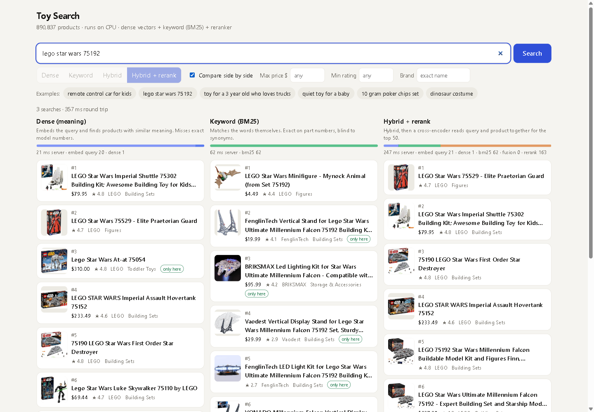
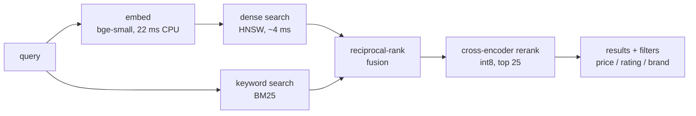
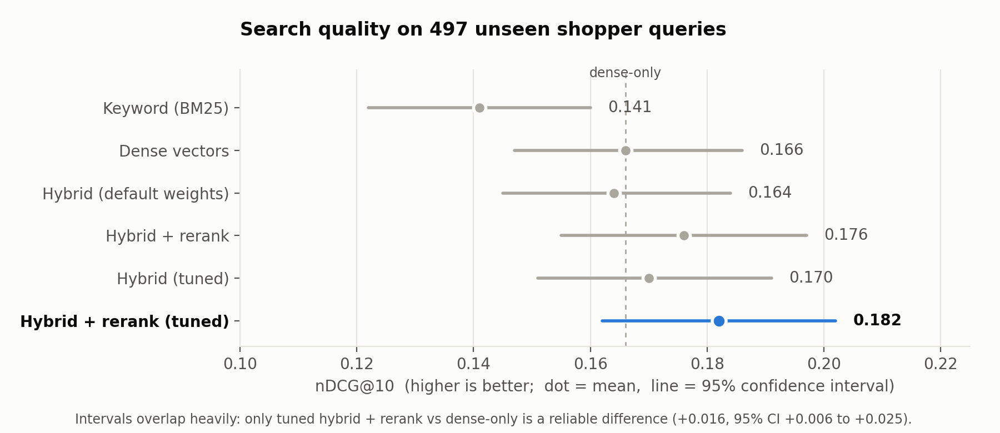
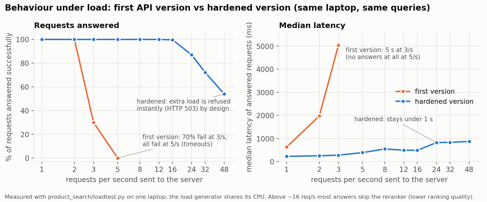

# LLM-MASTERY

[](https://github.com/Tushal27/LLM-MASTERY/actions/workflows/tests.yml)


**Hybrid semantic search over 890,837 products, evaluated against human relevance labels, load-tested, and hardened
until it stopped collapsing under traffic.** Plus the from-scratch LLM work that led to it. Everything runs on one
consumer laptop (GTX 1050 Ti, 16 GB RAM), and the numbers below are measured, including the unflattering ones.



## At a glance

| | |
|---|---|
| **What** | Search engine over the Amazon Toys & Games catalog: dense vectors + BM25 + rank fusion + cross-encoder reranker, behind a FastAPI service with a web UI |
| **Scale** | 890,837 products; serving is CPU-only (query embedding 22 ms, approximate-NN search 4 ms) |
| **Proof** | 497 held-out real shopper queries with human labels, bootstrap confidence intervals, a load tester, 19 unit tests, CI, Docker image |
| **Stack** | Python, PyTorch, sentence-transformers, FAISS (HNSW), bm25s, FastAPI, Docker, GitHub Actions |

**Three results worth knowing**
1. **Quality is a small, real gain, not a leap.** The full tuned pipeline beats dense-only search by +0.016 nDCG@10
   (95% CI +0.006 to +0.025). Most other differences are inside the noise, and the README says so.
2. **Approximate search was the biggest speed-up for almost no quality cost:** dense search 135 ms → 4 ms, finding 95% of the exact top-10.
3. **The first API version collapsed at 3 requests/s** (70% timeouts; 100% at 5/s). The rewrite answers cleanly up to 12/s and refuses extra load instantly instead of falling over.

Design decisions, mistakes and what I'd do next: [`docs/DESIGN_NOTES.md`](docs/DESIGN_NOTES.md).

## How it works



Dense vectors understand *meaning* ("toy for a 3 year old who loves trucks") but miss exact model numbers; BM25 nails
`lego 75192` but misses synonyms; fusion combines them and a cross-encoder orders the best few. On the query in the
screenshot, dense search returned other Lego sets and none of the real 75192 sets, BM25 returned only accessories that
mention the number, and the hybrid + rerank pipeline was the only one to surface the real sets, at ranks 5 and 6. That
is far from ideal: with the original untuned settings the real set ranked 1st-2nd, and the tuned settings traded that
for a small average gain (the difference on queries containing numbers was not statistically significant). Results
flagged "only here" in the compare view were found by just one method.

## Search quality



| Pipeline | nDCG@10 | 95% CI | p50 latency (CPU) |
|---|---|---|---|
| Keyword (BM25) | 0.141 | [0.122, 0.160] | 36 ms |
| Dense vectors | 0.166 | [0.147, 0.186] | 150 ms |
| Hybrid (default weights) | 0.164 | [0.145, 0.184] | 211 ms |
| Hybrid + rerank | 0.176 | [0.155, 0.197] | 515 ms |
| **Hybrid + rerank, tuned on training queries** | **0.182** | [0.162, 0.202] | 515 ms |

Ground truth is Amazon's ESCI shopping-queries dataset. Settings were tuned on separate training queries; the 497 test
queries were never used for tuning. ESCI only labels products Amazon's own search showed, so equally relevant
near-duplicate listings count as wrong, for every method: trust the comparison between rows more than the absolute scores.

**Speed without wrecking quality** (each measured on the test queries):

| Change | Speed | Quality |
|---|---|---|
| Exact → HNSW dense search | 135 ms → **4 ms** | finds 95% of the exact top-10; dense nDCG 0.1656 → 0.1606 |
| fp32 → int8 reranker (top 50) | 386 ms → **229 ms** | 0.1824 → 0.1823 |
| Rerank top 50 → top 25 | 229 ms → **133 ms** | 0.1823 → 0.1792 |

## Behaviour under load



The first version (one lock around everything) handled ~1.5 requests/s and then collapsed, because the server kept
working through requests whose clients had already given up. The rewrite adds a query cache, bounded in-flight
requests, a queue-time budget, and a fallback that skips the reranker under load. The load tester is open-loop
(Poisson arrivals), so a struggling server cannot slow the test down and hide the overload.

Honest limits: measured on one laptop with the load generator on the same CPU. Full-quality (reranked) capacity is about
**5-8 req/s**; the 22-25 req/s plateau is mostly answers where the reranker was skipped. A repeat-heavy test reached a
71% cache hit rate, but it used a small, pre-warmed query pool, so treat that as a best case. Inside a Docker container on
WSL2 the same machine sustained roughly a third of the bare-metal throughput. Testing the container also caught a real bug
(HTTP 500 for products with a missing brand under pandas 3); it is fixed and has a regression test.

## Run it

```bash
pip install torch sentence-transformers faiss-cpu==1.15.1 bm25s PyStemmer pandas pyarrow fastapi uvicorn httpx huggingface_hub

python product_search/download_data.py     # Amazon Toys catalog + ESCI relevance labels (~3.5 GB)
python product_search/catalog.py           # clean catalog
python product_search/build_index.py       # embeddings (GPU, ~1 hour) + BM25
python product_search/build_hnsw.py        # approximate index (~5 min)
python product_search/api.py               # http://127.0.0.1:8000  (UI at /, docs at /docs)

python product_search/build_eval.py && python product_search/evaluate.py     # reproduce the quality table
python product_search/loadtest.py --rates 2,5,10 --duration 20               # load test a running server
python -m unittest discover -s product_search/tests                          # unit tests
python docs/make_charts.py                                                   # redraw the charts from product_search/results/
```

Docker and cloud deployment: [`product_search/DEPLOY.md`](product_search/DEPLOY.md).

## Repository map

| Folder | What it is |
|---|---|
| [`product_search/`](product_search) | **The flagship**: search service, evaluation harness, tuning, load tester, Docker, tests, saved results |
| [`translator/`](translator) | English→French translator: **hand-written LoRA** fine-tune of Qwen2.5-0.5B + Flask page. BLEU 14.7 → 18.1 on 300 unseen sentences; it still makes real mistakes (it mistranslates "book a table"), because the training data is mostly film subtitles |
| [`local-inference/`](local-inference) | Fast local chat: `qwen_chat.py` (fp16, static KV cache, **CUDA-graph decoding**: 17 → ~27 tok/s on the 0.5B model) and `llama_chat.py` (4-bit GGUF through llama.cpp: ~60 tok/s for the 1.5B model vs 12-16 in PyTorch) |
| [`assistant/`](assistant) | Local tool-using assistant: tool calling, persistent memory, guardrails, eval suite (Qwen2.5-0.5B, fully offline) |
| [`learning/`](learning) | The from-scratch curriculum (below) |
| [`docs/`](docs) | Screenshot, charts and the design notes |

<details>
<summary><b>The learning path</b> (five weeks of small, runnable scripts)</summary>

| Week | Topics |
|---|---|
| 1 | BPE tokenizer from scratch (cleaning, dedup, quality filters), embeddings, attention, transformer |
| 2 | Inference pipeline: stacking blocks, logits, sampling (temperature, top-k, top-p), repetition penalties, KV cache |
| 3 | Context window, KV cache, prompt caching, quantization, GGUF, continuous batching |
| 4 | Mixture of experts, fine-tuning, LoRA, RLHF, distillation, reasoning models, MCP |
| 5 | Prompt engineering, structured outputs, tool calling, agents, multi-agent systems, memory, planning, guardrails, evals |
| Bonus | Train a tiny language model and watch gibberish become text |

Install the dependencies for everything outside `product_search/` with `pip install -r requirements.txt`.
</details>

## Data, models and licenses

Code is MIT-licensed ([`LICENSE`](LICENSE)). Datasets and models keep their own licenses; check them before reusing
anything commercially: Amazon Reviews 2023 (McAuley Lab; released for research use), Amazon Shopping Queries / ESCI,
OPUS-100, Project Gutenberg texts (public domain). Models are downloaded from Hugging Face at run time
(`BAAI/bge-small-en-v1.5`, `cross-encoder/ms-marco-MiniLM-L-6-v2`, `Qwen/Qwen2.5-*-Instruct`). Large files (indexes,
datasets, model weights) are not in this repository; the commands above rebuild them.

---
Built by **Tushal J**, software engineer (full-stack and AI) · [LinkedIn](https://www.linkedin.com/in/tushal-j) · [GitHub](https://github.com/Tushal27)
