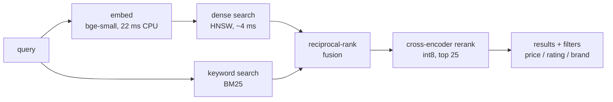

# LLM-MASTERY

[](https://github.com/Tushal27/LLM-MASTERY/actions/workflows/tests.yml)

Hands-on LLM engineering, built from scratch and measured honestly: from tokenizers and attention up to a
**hybrid semantic search service over 890,837 products that was load-tested and hardened for production traffic.**

Everything here runs on a single consumer laptop (GTX 1050 Ti, 4 GB VRAM, 16 GB RAM).

## Flagship project: toy product search (`product_search/`)

A search engine over **890,837 Amazon Toys & Games products**. It combines meaning-based vector search with
keyword search and a reranker, runs **CPU-only at serving time**, and ships as a FastAPI service with a web UI,
an evaluation harness, a load tester, and a Docker image.



Why three stages: dense vectors understand *meaning* ("toy for a 3 year old who loves trucks") but miss exact
model numbers; BM25 nails "lego 75192" but misses synonyms; fusion combines them and a cross-encoder reads
query and product together to order the best few. On the query `lego star wars 75192`, dense search returned
other Lego sets, BM25 returned display stands that mention the number, and only the hybrid + rerank
pipeline put the actual set first.

### Search quality (497 held-out real shopper queries, human relevance labels from Amazon ESCI)

| Pipeline | nDCG@10 | 95% CI | p50 latency (CPU) |
|---|---|---|---|
| BM25 only | 0.141 | [0.122, 0.160] | 36 ms |
| Dense only (exact) | 0.166 | [0.147, 0.186] | 150 ms |
| Hybrid (BM25 + dense, RRF) | 0.164 | [0.145, 0.184] | 211 ms |
| Hybrid + rerank | 0.176 | [0.155, 0.197] | 515 ms |
| **Hybrid + rerank, tuned on training queries** | **0.182** | [0.162, 0.202] | 515 ms |

**Read this honestly.** Confidence intervals are bootstrapped over queries. Only one comparison is
statistically distinguishable from noise: tuned hybrid + rerank beats dense-only by +0.016 nDCG
(95% CI +0.006 to +0.025). The other gaps (e.g. reranking over plain hybrid, +0.012) are within noise at this
sample size. Absolute scores are low partly because ESCI only labels products Amazon's own search showed:
near-duplicate listings that are equally relevant count as wrong, for every method equally. Settings were
tuned on separate training queries; the 497 test queries were never used for tuning.

### Making it fast without wrecking quality (each measured on the test queries)

| Change | Effect |
|---|---|
| Exact → HNSW dense search | 135 ms → **4 ms** per query; finds 95% of the exact top-10; dense nDCG 0.1656 → 0.1606 |
| fp32 → int8 reranker (top 50) | 386 ms → **229 ms**; nDCG 0.1824 → 0.1823 |
| Rerank top 50 → top 25 | 229 ms → **133 ms**; nDCG 0.1823 → 0.1792 |

### Surviving traffic (load tested; open-loop Poisson arrivals, `loadtest.py`)

The first version (one lock around everything) handled ~1.5 requests/s, then **collapsed**: 70% timeouts at
3 req/s and 100% at 5 req/s, because the server kept grinding through requests whose clients had already
given up. The rewrite adds a query cache, bounded in-flight requests, a queue-time budget, and a fallback
that skips the reranker under load:

| Offered load | Old API | New API |
|---|---|---|
| 2 req/s | p50 1,975 ms | p50 252 ms, 0% errors |
| 5 req/s | 100% timeouts | p50 389 ms, 0% errors |
| 12 req/s | – | 0% errors (across the whole 1-12 req/s run, a third of answers were downgraded: reranker skipped) |
| 48 req/s | – | ~54% served, rest rejected instantly with 503; p99 of served requests < 1.7 s |

Caveats, stated plainly: this was measured on one laptop with the load generator on the same CPU. Full-quality
(reranked) capacity is roughly **5-8 req/s**; the ~22-25 req/s plateau is mostly answers where the reranker was
skipped. Traffic with repeated queries (cache hit rate 71% in one test) was much cheaper, but that test used a
small, pre-warmed query pool, so treat it as a best case. Inside a Docker container on WSL2 the same machine
sustained roughly a third of the bare-metal throughput.

Testing the container also caught a real bug (HTTP 500 when a product had a missing brand, because pandas 3
stores missing text as NaN); it is fixed and covered by a regression test.

### Run it

```bash
pip install torch sentence-transformers faiss-cpu==1.15.1 bm25s PyStemmer pandas pyarrow fastapi uvicorn httpx huggingface_hub

python product_search/download_data.py     # Amazon Toys catalog + ESCI relevance labels (~3.5 GB)
python product_search/catalog.py           # clean catalog
python product_search/build_index.py       # embeddings (GPU, ~1 hour) + BM25
python product_search/build_hnsw.py        # approximate index (~5 min)
python product_search/api.py               # http://127.0.0.1:8000  (UI at /, docs at /docs)

python product_search/build_eval.py && python product_search/evaluate.py     # reproduce the quality table
python product_search/loadtest.py --rates 2,5,10 --duration 20               # load test a running server
python -m unittest discover -s product_search/tests                          # unit tests
```

Docker and cloud deployment: see [`product_search/DEPLOY.md`](product_search/DEPLOY.md).

## More projects

| Project | What it shows | Result |
|---|---|---|
| [`translator/`](translator) | English→French translator: **hand-written LoRA** fine-tune of Qwen2.5-0.5B + Flask page | BLEU 14.7 → 18.1 on 300 unseen sentences. It still makes real mistakes (e.g. mistranslates "book a table"); the training data is mostly subtitles. |
| [`qwen_chat.py`](qwen_chat.py) | Fast local chat: fp16, static KV cache, **CUDA-graph decoding**, streaming, token throughput | 0.5B model: 17 → ~27 tok/s on a GTX 1050 Ti vs plain `generate()` |
| [`llama_chat.py`](llama_chat.py) | Chat over llama.cpp (4-bit GGUF, Vulkan) | ~60 tok/s for the 1.5B model vs 12-16 with PyTorch on the same GPU |
| [`assistant/`](assistant) | Local tool-using assistant: tool calling, persistent memory, guardrails, eval suite | Qwen2.5-0.5B, runs fully offline |
| `bonus-training/` | Train a tiny language model and watch gibberish become text | |

## The learning path

Built week by week, each script runnable on its own and kept deliberately small:

| Week | Topics |
|---|---|
| 1 | BPE tokenizer from scratch (cleaning, dedup, quality filters), embeddings, attention, transformer |
| 2 | Inference pipeline: stacking blocks, logits, sampling (temperature, top-k, top-p), repetition penalties, KV cache |
| 3 | Context window, KV cache, prompt caching, quantization, GGUF, continuous batching |
| 4 | Mixture of experts, fine-tuning, LoRA, RLHF, distillation, reasoning models, MCP |
| 5 | Prompt engineering, structured outputs, tool calling, agents, multi-agent systems, memory, planning, guardrails, evals |

## Data, models and licenses

Code is MIT-licensed (see [`LICENSE`](LICENSE)). Datasets and models keep their own licenses; check them before
reusing anything commercially:

* Amazon Reviews 2023 (McAuley Lab) - product catalog. Released for research use.
* Amazon Shopping Queries / ESCI - relevance labels.
* OPUS-100 - translation pairs. Project Gutenberg texts in `week1-tokenizer/data/` - public domain.
* Models are downloaded from Hugging Face at run time: `BAAI/bge-small-en-v1.5`,
  `cross-encoder/ms-marco-MiniLM-L-6-v2`, `Qwen/Qwen2.5-*-Instruct`.

Large files (indexes, datasets, model weights) are not in this repository; the commands above rebuild them.
